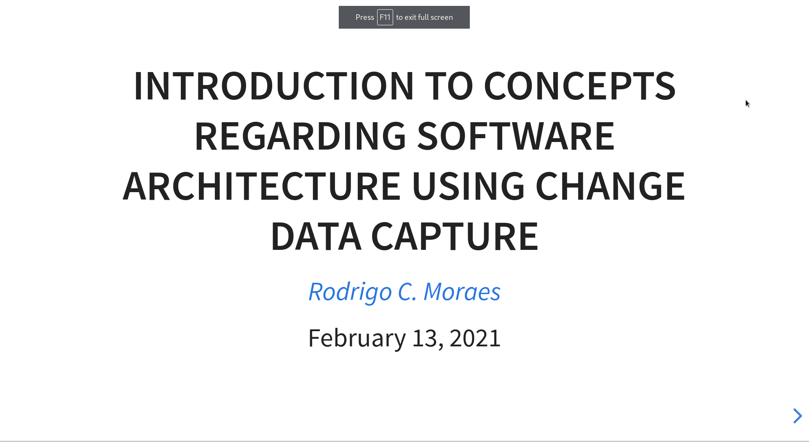

# Description

This repository is a presentation introducing concepts regarding CDC - Change Data Capture.

## Presentation Preview

## References

* [Debezium Documentation](https://debezium.io/documentation/reference/1.4/index.html)
* [Change Data Capture Using Debezium Kafka and Pg](https://www.startdataengineering.com/post/change-data-capture-using-debezium-kafka-and-pg/)
* [Making Sense of Change Data Capture Pipelines for Postgres with Debezium Kafka Connector](https://turkogluc.com/postgresql-capture-data-change-with-debezium/)
* [Debezium Connector For Postgresql](https://access.redhat.com/documentation/en-us/red_hat_integration/2020-04/html/debezium_user_guide/debezium-connector-for-postgresql)
* [Microservice Architecture — Communication & Design Patterns](https://outline.com/Xa6beU)
* [Youtube playlist](https://www.youtube.com/playlist?list=PLHQXtr5rNVQStxWhF3sD_rGl-R_PGFzwB)
