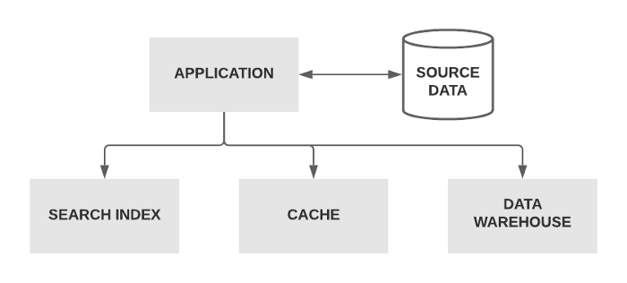
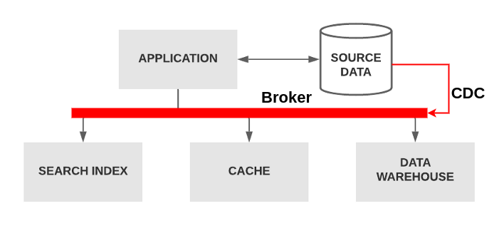

% Introduction to concepts regarding Software Architecture using Change Data Capture
% *[Rodrigo C. Moraes](https://github.com/rodrigocmoraes)*
% February 13, 2021

# Motivation

--------------------------------------------------------------------------------

## General application



::: notes

Every Application needs some sort of **data storage**, in general we use databases such as MySQL, Postgres, MongoDB
and so on 
If our application succeeds is natural for it to increase the load on its **infrastructure**
In order to solve this issue, we general start small by using some generic strategies like **Cache**
So this give us performance improvement without too much costs
In general it's a good trade-off
Later, it's commom for applications starts to log things about it's behavior and later we'll need to get this info
log are plain text, and a tool that are efficient to retrieval content in text are tools which execute **Full Text Search**
And in order to fast retrieval this tool creates a search index for it
When an application grows is a sing that the business is growing too, due that companies would like to start
to get **insights** about its application
Now that we have all this architectural components how do we keep it working?
hard right?
and we know that's already hard to develop a good application, so thinking about keep this components working with just this
components is hard.

:::

## Problems

* Application overload with responsabilities outside its domain
* Replicate data to datawarehouse
* Store and update cache
* Store data in Full Text Search tool

## Possible Solution 



Instead of going to look for data, you can automatically respond to it with low-latency.

## Improves

* Application responsabilities shrink
* Broker handle data exchange safetly
* Broker with CDC replicates database content to an OLAP environment

# What is CDC?

## CDC - Change Data Capture

**C**hange **D**ata **C**apture, or CDC, is an older term for a **system that monitors and captures the 
changes in data so that other software can respond to those changes**. Data warehouses often 
had built-in CDC support, since data warehouses need to stay up-to-date as the data changed 
in the upstream OLTP databases.

<font size="5">Source:</font> <font size="5">[Debezium FAQ](https://debezium.io/documentation/faq/#what_is_change_data_capture)</font>

## CDC - Change Data Capture


## Use cases

* Replicate data
* Enrich and store data
* Propagate data between microservices

# What is Debezium?

## 


## Debezium

Debezium is a **set of distributed services** that capture **row-level changes** in your 
databases so that your applications can see and respond to those changes. Debezium 
records in a **transaction log** all row-level changes committed to **each database table**.

<font size="5">Source:</font> <font size="5">[Debezium FAQ](https://debezium.io/documentation/faq/#what_is_debezium)</font>

::: notes

Debezium is built on top of Apache Kafka 

::: 

## Debezium Architecture


::: notes

In essence Debezium is a series of connectors : sourcing and sinking

::: 

## Debezium - Database Management Systems

* MongoDB
* MySQL
* PostgreSQL
* SQL Server
* Oracle (Incubating)
* Db2 (Incubating)
* Cassandra (Incubating)
* Vitess (Incubating)

Each DBMS has a specific approce to CDC.

:::notes

An incubating connector is one that has been released for preview purposes 
and is subject to changes that may not always be backward compatible.

:::

# Transaction Log

## Transaction Log

In the field of databases in computer science, a transaction log (also transaction journal, 
database log, binary log or audit trail) is a **history of actions executed by a database 
management system** used to guarantee ACID properties over **crashes or hardware failures**. 
Physically, a log is a file listing changes to the database, **stored in a stable storage format**.

<font size="5">Source:</font> <font size="5">[Wikipedia](https://en.wikipedia.org/wiki/Transaction_log)</font>

## Advantages of CDC solutions based on Transaction Logs

- Minimal impact on the database;
- No need for programmatic changes to the applications that use the database;
- Low latency in acquiring changes;
- Transactional integrity;
- No need to change the database schema.

<font size="5">Source:</font> <font size="5">[Wikipedia](https://en.wikipedia.org/wiki/Change_data_capture)</font>

::: notes

Debezium is based on transaction logs

::: 

## Query based CDC
    
* Pooling
    * Impossible to stay up to date
    * High frequency update increase database load
    * May lose deleted data if timestamp or other strategy isn't applied

# CDC and Events


<font size="5">Source:</font> <font size="5">[Kislayverma.com](https://kislayverma.com/software-architecture/domain-events-versus-change-data-capture/)</font>

::: notes

Events have business impact, they occurs at domain level.
This domain level are composed by bounded contexts

Events are composed by System Events

e.g.: a package has a lot of different status, but just some 
      are displayed to end user.

In essence all Events is Change that could captured, but these are just at Domain Level

::: 

## CDC - Changes

```json
{
    "before": {...},
    "after": {...},
    "metadata": {
        "log file": "path to log file",
        "transaction_id": "",
        "timestamp": "when this event happened",
        ...
    }
}
```

# What is Kafka ?

##


## Kafka

Apache Kafka is a fast, scalable, durable, and distributed messaging system that records all messages 
in replicated, partitioned, and totally-ordered transaction logs.

<font size="5">Source:</font> <font size="5">[Debezium FAQ](https://debezium.io/documentation/faq/#what_is_kafka)</font>

# Demo


# Takeaways

* Each DBMS requires specific settings
* CDC Architectures add complexity to manage Infrastructure
* CDC Architectures decouple data flow
* CDC Architectures can handle high throughtput of data
* Debezium is just a solution of CDC
* Debezium and Kakfa are open source
* Always try to balance KISS and DRY, it means be Pragmatic

## 


# References

* [Debezium Documentation](https://debezium.io/documentation/reference/1.4/index.html)
* [Change Data Capture Using Debezium Kafka and Pg](https://www.startdataengineering.com/post/change-data-capture-using-debezium-kafka-and-pg/)
* [Making Sense of Change Data Capture Pipelines for Postgres with Debezium Kafka Connector](https://turkogluc.com/postgresql-capture-data-change-with-debezium/)
* [Debezium Connector For Postgresql](https://access.redhat.com/documentation/en-us/red_hat_integration/2020-04/html/debezium_user_guide/debezium-connector-for-postgresql)
* [Microservice Architecture — Communication & Design Patterns](https://outline.com/Xa6beU)
* [Youtube playlist](https://www.youtube.com/playlist?list=PLHQXtr5rNVQStxWhF3sD_rGl-R_PGFzwB)
