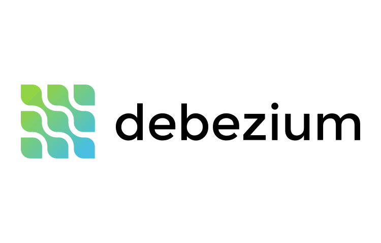

% A Change Data Capture Architecture with Debezium and Kafka
% *[Rodrigo C. Moraes](https://github.com/rodrigocmoraes)*
% February 13, 2021

# What is Debezium?

## 

##

Debezium is a **set of distributed services** that capture **row-level changes** in your 
databases so that your applications can see and respond to those changes. Debezium 
records in a transaction **log** all row-level changes committed to **each database table**.

Source: [Debezium FAQ](https://debezium.io/documentation/faq/#what_is_debezium)

::: notes

This is my note.

- It can contain Markdown

::: 

## What is Change Data Capture?

**C**hange **D**ata **C**apture, or CDC, is an older term for a **system that monitors and captures the 
changes in data so that other software can respond to those changes**. Data warehouses often 
had built-in CDC support, since data warehouses need to stay up-to-date as the data changed 
in the upstream OLTP databases.

Source: [Debezium FAQ](https://debezium.io/documentation/faq/#what_is_change_data_capture)

## Advantages of CDC solutions based on transaction logs

- Minimal impact on the database;
- No need for programmatic changes to the applications that use the database;
- Low latency in acquiring changes;
- Transactional integrity;
- No need to change the database schema.

Source: [Wikipedia](https://en.wikipedia.org/wiki/Change_data_capture)

::: notes

Debezium is based on transaction logs

::: 

## CDC and Events

Source: [Kislayverma.com](https://kislayverma.com/software-architecture/domain-events-versus-change-data-capture/)

::: notes

Events have business impact, they occurs at domain level.
This domain level are composed by bounded contexts

Events are composed by System Events

e.g.: a package has a lot of different status, but just some 
      are displayed to end user.

In essence all Events is Change that could captured, but these are just at Domain Level

::: 

## Motivation

Source: [Medium - Dunith Dhanushka](https://medium.com/event-driven-utopia/a-gentle-introduction-to-event-driven-change-data-capture-683297625f9b)

::: notes

Talk about

1. If an application would to know some info about a change in database?
Should it pulling? On client? What frequency of pooling?

2. If there multiple applications and change should be propragated through all
of them, it should know about the existence of all others?

::: 

# What is Kafka ?

##

##

Apache Kafka is a fast, scalable, durable, and distributed messaging system that records all messages 
in replicated, partitioned, and totally-ordered transaction logs.

Source: [Debezium FAQ](https://debezium.io/documentation/faq/#what_is_kafka)
